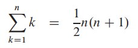
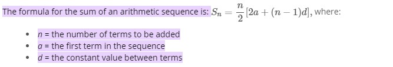
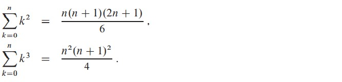
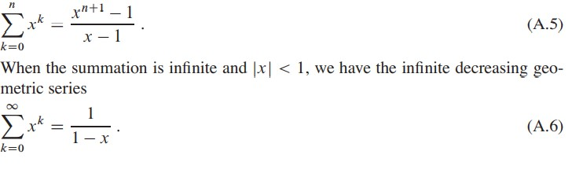
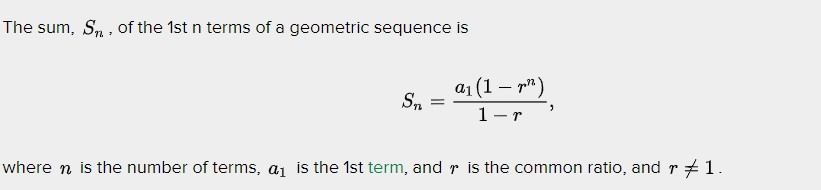
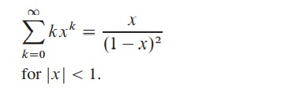
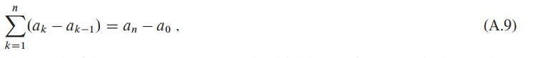
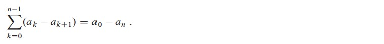
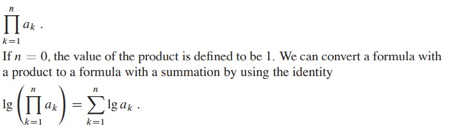

# Summations
- Finite series' terms can be added in any order.
- Infinite series have two possibalities depending on the limit of summation
    - Limit does not exist -> the series **diverges**.
    - Limit exists -> the series **converges**.
        - Terms of convergent series cannot always be added in any order.
        - only an absoultly convergant series can.
- Summation of ( infinite convergant and finite ) series is linear
## Formulas 
### Arithmetic summation

### Sum of squares and cubes

### Geometric series

### Intergrating and differentiating series
By integrating or differentiating the formulas above, additional formulas arise

### Telescoping Series

### Products 

